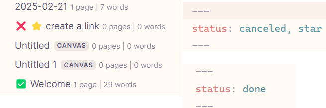

# Frontmatter Task Mgmt

Add status icons to your files automatically based on frontmatter status field. The plugin monitors your files in real-time and updates the icons as you change the status in your frontmatter.

See the icons on the obsidian file explorer. good for task management through file.



## Features

- Automatically adds status icons based on frontmatter
- Supports multiple status values
- Updates in real-time
- No configuration needed

## Usage

Add a `status` field to your file's frontmatter:

```yaml
---
status: todo
---
```

Or multiple statuses:

```yaml
---
status: [todo, important]
---
```

## Available Status Icons

| Status | Icon | Description |
|--------|------|-------------|
| todo | 🔲 | Task to be done |
| incomplete | 🟡 | Work in progress |
| done | ✅ | Completed task |
| canceled | ❌ | Canceled or abandoned |
| forwarded | ➡️ | Forwarded or moved |
| scheduling | 📅 | Needs scheduling |
| question | ❓ | Needs clarification |
| important | ⚠️ | Important item |
| star | ⭐ | Starred item |
| quote | 💬 | Contains quotes |
| location | 📍 | Location-related |
| bookmark | 🔖 | Bookmarked information |
| information | ℹ️ | Information note |
| savings | 💰 | Finance-related |
| idea | 💡 | Ideas or concepts |
| pros | 👍 | Positive points |
| cons | 👎 | Negative points |
| fire | 🔥 | Hot/Urgent |
| key | 🔑 | Key information |
| win | 🏆 | Achievement |
| up | ⬆️ | Increasing/Growing |
| down | ⬇️ | Decreasing/Declining |

## Installation

### Community Plugin (Recommended)

1. Open Obsidian Settings
2. Go to Community Plugins and disable Safe Mode
3. Click Browse and search for "Frontmatter Task Mgmt"
4. Install and enable the plugin

### Manual Installation

1. Download `main.js`, `styles.css`, and `manifest.json` from the latest release
2. Copy these files to your vault's `.obsidian/plugins/frontmatter-status-icons/` directory

## Development

### Prerequisites

- NodeJS v16 or higher
- npm or yarn

### Quick Start

1. Clone this repository
2. Install dependencies:
   ```bash
   npm install
   ```
3. Start development build:
   ```bash
   npm run dev
   ```

### Building

For production build:

```bash
 npm run build
```

### Code Quality

Run ESLint to check code quality:

```bash
npm run lint
```

## Support

If you encounter any issues or have suggestions:

1. Check the GitHub Issues to see if it's already reported
2. If not, create a new issue with:
   - Obsidian version
   - Plugin version
   - Steps to reproduce
   - Expected vs actual behavior

## Requirements

- Obsidian v0.15.0 or higher

## License

This project is licensed under the MIT License - see the LICENSE file for details.